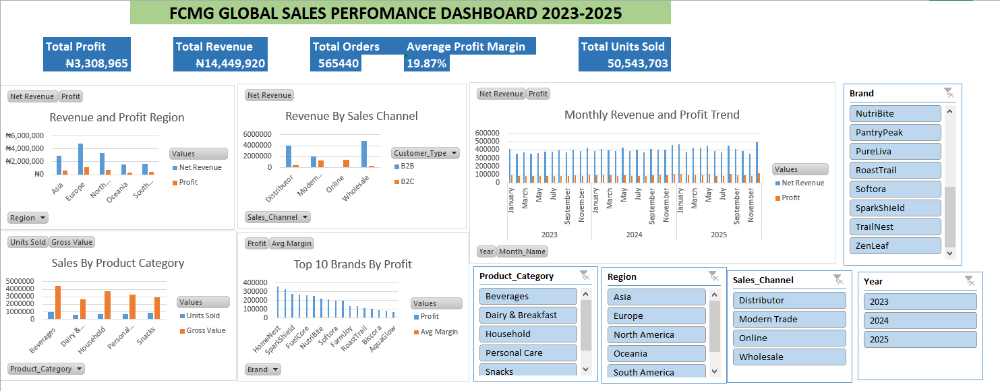

# FMCG Global Sales Performance Dashboard 2023-2025

## Project Overview
This project analyzes global FMCG (Fast-Moving Consumer Goods) 
sales performance across regions, channels, brands and product 
categories from 2023 to 2025.

## Objective
To identify which regions, products, sales channels and brands 
drive the most profitable FMCG sales, and uncover trends in 
revenue and profit over time.

## Tools Used
- Microsoft Excel
- Pivot Tables
- Pivot Charts
- IF Functions
- KPI Cards
- Slicers

## Dataset
- Source: Kaggle (FMCG Sales & Marketing Profitability Dataset)
- Records: 18,241 rows
- Period: 2023 - 2025
- Note: All monetary values displayed in Nigerian Naira (₦)

## Key Findings
- Total Revenue: ₦14,449,920
- Total Profit: ₦3,308,965
- Average Profit Margin: 19.87%
- Total Orders: 565,440
- Total Units Sold: 50,543,703

## Dashboard Features
- Revenue and Profit by Region
- Revenue by Sales Channel (B2B vs B2C)
- Sales by Product Category
- Top 10 Brands by Profit
- Monthly Revenue and Profit Trend (2023-2025)
- Interactive slicers for Region, Year, 
  Product Category, Sales Channel and Brand

## Dashboard Preview

## Author
Akah Ebenezer Chukwuemeka
Data Analyst | Founder, Mekuzhandy Tech Academy
GitHub: github.com/akah-ebenezer
Email: akahebenezerchukwuemeka@gmail.com
